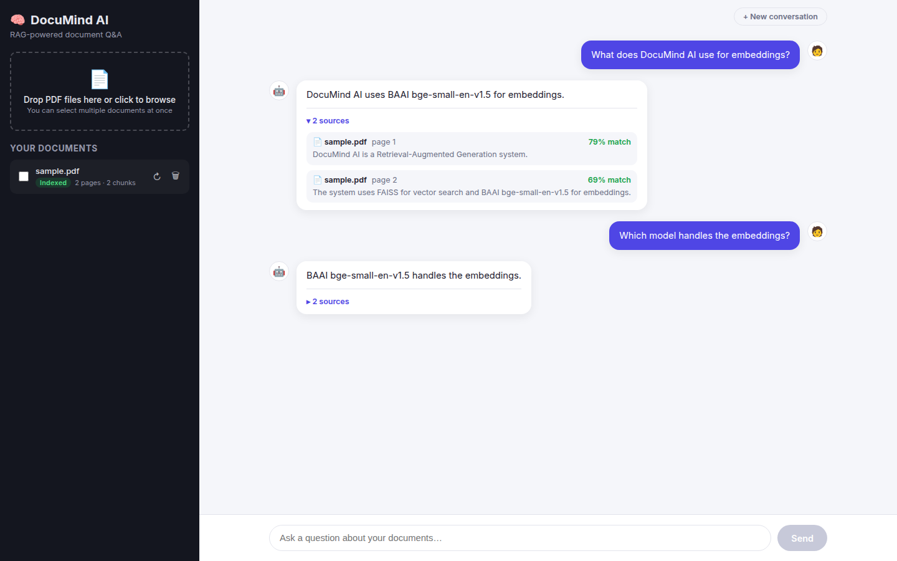
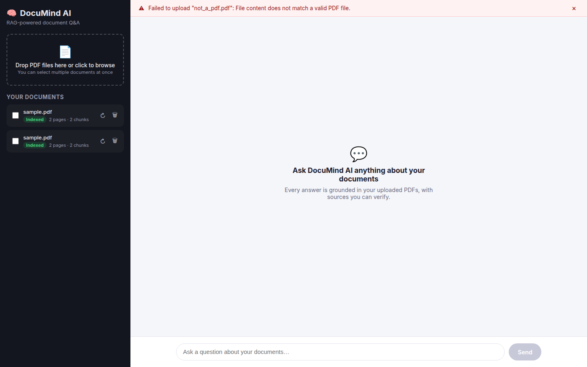

# 🧠 DocuMind AI

**DocuMind AI** is a Retrieval-Augmented Generation (RAG) system that lets you upload PDF documents and ask natural-language questions about them. Every answer is grounded strictly in the content of your own documents — with clickable, verifiable sources — instead of relying on an LLM's general (and often hallucinated) knowledge.

This project was built as a hands-on, portfolio-quality demonstration of production backend engineering and applied AI: REST API design, file processing, semantic search, RAG, clean layered architecture, and full-stack integration.

<p align="center">
  
</p>

## Table of contents

- [What it does](#what-it-does)
- [Tech stack](#tech-stack)
- [Architecture](#architecture)
- [Folder structure](#folder-structure)
- [Getting started](#getting-started)
- [API reference](#api-reference)
- [Testing](#testing)
- [Design decisions (the "why")](#design-decisions-the-why)
- [Deployment](#deployment)
- [Known limitations & next steps](#known-limitations--next-steps)
- [Interview talking points](#interview-talking-points)

## What it does

1. Upload one or more PDF documents.
2. The backend extracts their text, splits it into overlapping chunks, and embeds each chunk into a vector space.
3. Ask a question in plain English.
4. The system embeds the question, finds the most semantically similar chunks across your documents (FAISS), and feeds them — along with your question — into a local LLM (via Ollama) with an explicit instruction to answer *only* from that context.
5. You get a grounded answer plus the exact source passages (document name, page number, similarity score) it was based on.

<p align="center">
  
</p>

## Tech stack

| Layer | Choice | Why |
|---|---|---|
| Backend framework | FastAPI + Uvicorn | Async-first, automatic OpenAPI docs, first-class Pydantic validation |
| Document parsing | PyMuPDF (`fitz`) | Fast, C-based PDF text extraction with good layout fidelity |
| Chunking | `langchain-text-splitters` | Battle-tested recursive splitting that respects paragraph/sentence boundaries |
| Embeddings | `sentence-transformers` — `BAAI/bge-small-en-v1.5` | Strong retrieval performance for its size; runs comfortably on CPU |
| Vector search | FAISS (`IndexFlatIP` + `IndexIDMap`) | Exact, fast cosine-similarity search; persists to disk |
| Metadata / chat history | SQLite via SQLAlchemy | Zero-setup relational storage for documents, chunks, conversations |
| LLM | Ollama (Qwen 2.5 by default) | Free, local, private — no API keys needed during development |
| Frontend | React + Vite | Fast dev server, minimal config, huge ecosystem |
| Deployment | Render (backend), Vercel (frontend) | Free/cheap tiers, Docker + static-site support out of the box |

## Architecture

```mermaid
flowchart TD
    U[User] --> FE[React Frontend]
    FE -->|REST / JSON| API[FastAPI Backend]

    subgraph Ingestion["Document ingestion (per uploaded PDF)"]
        API --> Save[Save PDF to disk]
        Save --> Extract[Extract text - PyMuPDF]
        Extract --> Chunk[Chunk text - LangChain splitter]
        Chunk --> Embed1[Embed chunks - bge-small-en-v1.5]
        Embed1 --> FAISS[(FAISS vector index)]
        Chunk --> SQL[(SQLite: documents + chunks)]
    end

    subgraph "Question answering (RAG)"
        API --> EmbedQ[Embed the question]
        EmbedQ --> Search[Semantic search top-k chunks]
        FAISS --> Search
        Search --> Prompt[Build grounded prompt]
        Prompt --> LLM[Ollama LLM - Qwen 2.5]
        LLM --> Answer[Grounded answer + sources]
        Answer --> ChatDB[(SQLite: conversations + messages)]
        Answer --> FE
    end
```



## Folder structure

```
DocuMind-AI/
├── backend/
│   ├── app/
│   │   ├── main.py            # FastAPI app wiring (CORS, routers, exception handlers)
│   │   ├── routes/            # Thin HTTP layer: documents, chat, health
│   │   ├── services/          # Business logic: pdf, chunking, embedding, vector store, llm, rag
│   │   ├── models/            # SQLAlchemy ORM models + Pydantic request/response schemas
│   │   ├── utils/             # Logging, custom exceptions, upload validation
│   │   └── config/            # Typed settings (pydantic-settings)
│   ├── tests/                 # Unit + API integration tests (pytest)
│   ├── uploads/                # Saved PDF files (gitignored contents)
│   ├── vectorstore/            # Persistent FAISS index (gitignored contents)
│   ├── data/                   # SQLite database (gitignored contents)
│   ├── requirements.txt
│   ├── Dockerfile
│   └── render.yaml
├── frontend/
│   ├── src/
│   │   ├── api/client.js       # Thin fetch wrapper for the backend API
│   │   ├── components/         # Sidebar, DocumentUpload, DocumentList, ChatPanel, ...
│   │   └── App.jsx             # Top-level state and orchestration
│   └── vercel.json
└── docs/
    └── screenshots/
```

## Getting started

### Prerequisites

- Python 3.11+
- Node.js 18+
- [Ollama](https://ollama.com/) installed locally (for the LLM step)

### 1. Run Ollama

```bash
ollama serve                 # starts the local LLM server on :11434
ollama pull qwen2.5:3b       # or any other model you configure in .env
```

### 2. Run the backend

```bash
cd backend
python3 -m venv venv
source venv/bin/activate      # on Windows: venv\Scripts\activate
pip install -r requirements.txt
cp .env.example .env          # adjust values if needed
uvicorn app.main:app --reload
```

The API is now running at `http://localhost:8000`. Interactive docs (Swagger UI) are at `http://localhost:8000/docs`.

### 3. Run the frontend

```bash
cd frontend
npm install
cp .env.example .env          # points VITE_API_BASE_URL at the backend
npm run dev
```

Open `http://localhost:5173` and start uploading PDFs.

### 4. Run the tests

```bash
cd backend
source venv/bin/activate
pytest -q
```

## API reference

Full interactive documentation is auto-generated by FastAPI at `/docs` (Swagger UI) and `/redoc`. Summary:

| Method | Path | Description |
|---|---|---|
| `POST` | `/api/v1/documents/upload` | Upload a PDF; extracts, chunks, embeds, and indexes it |
| `GET` | `/api/v1/documents/` | List all uploaded documents and their status |
| `GET` | `/api/v1/documents/{id}` | Get metadata for one document |
| `DELETE` | `/api/v1/documents/{id}` | Delete a document (file + vectors + metadata) |
| `POST` | `/api/v1/documents/{id}/reindex` | Re-run chunking/embedding for a document already on disk |
| `POST` | `/api/v1/chat/ask` | Ask a question; runs the full RAG pipeline and returns a grounded answer + sources |
| `GET` | `/api/v1/chat/conversations` | List all chat conversations |
| `GET` | `/api/v1/chat/conversations/{id}` | Get a conversation's full message history |
| `GET` | `/health` | Liveness probe (used by Render/monitoring) |

## Testing

The backend ships with 28 automated tests (`backend/tests/`):

- **Unit tests** for upload validation and text chunking — pure logic, no I/O.
- **Unit tests** for the FAISS wrapper (add / search / remove / persist-and-reload) using small synthetic vectors.
- **API integration tests** exercising the full stack (FastAPI → services → SQLite → FAISS) using real, tiny PDFs generated on the fly with PyMuPDF, covering the happy path *and* failure modes (invalid file type, forged PDF content, empty/unreadable PDFs, missing documents, restricting search to specific documents, multi-turn conversation persistence).

The embedding model and the Ollama LLM call are mocked in these tests (see `tests/conftest.py`) so the suite runs in a few seconds with no GPU, no downloaded model weights, and no running LLM server required — a deliberate trade-off between speed/determinism and full end-to-end fidelity. The full pipeline (real `sentence-transformers` model, real FAISS index, real local Ollama server) was additionally verified manually end-to-end, including through the actual browser UI, during development.

## Design decisions (the "why")

Every service module in `backend/app/services/` has an extensive module-level docstring explaining *why* that library/algorithm was chosen and what trade-offs it makes — written so a reader learning backend/RAG development for the first time can follow along, not just copy code. A few highlights:

- **Why chunk text at all?** Embedding an entire document as one vector blurs many unrelated topics into a single point in vector space, making retrieval nearly useless. Small, overlapping chunks let each vector represent one coherent idea.
- **Why `IndexFlatIP` wrapped in `IndexIDMap`?** Storing L2-normalized embeddings lets a simple inner-product index compute cosine similarity; wrapping it in an ID map lets us reuse each chunk's own SQLite primary key as its FAISS vector ID, so there's no separate position-tracking table to keep in sync, and deletions/re-indexing stay simple.
- **Why explicitly instruct the LLM to say "I don't know"?** Without that instruction, LLMs default to sounding helpful even when the retrieved context doesn't actually answer the question — a well-known failure mode called hallucination. An explicit grounding instruction in the prompt is one of the cheapest, most effective mitigations.
- **Why separate `routes/` from `services/`?** Routes only translate HTTP ↔ Python; all business logic lives in services that don't know FastAPI exists. This keeps the ingestion/RAG pipeline testable and reusable outside the web layer.

## Deployment

### Backend → Render

`backend/render.yaml` defines a Render Blueprint that builds `backend/Dockerfile` and attaches a persistent disk (Render's default filesystem is ephemeral, and this app writes uploaded PDFs, the FAISS index, and its SQLite database to disk). Push the repo, connect it in the Render dashboard, and it will deploy from the blueprint automatically.

**Important:** Render's standard web services aren't a good fit for hosting an LLM directly (no GPU on most plans). Either run Ollama on a separate machine you control and set `OLLAMA_BASE_URL` to point at it, or swap `app/services/llm_service.py` for a call to a hosted LLM API — the rest of the RAG pipeline (retrieval, prompt construction, grounding) stays unchanged either way.

### Frontend → Vercel

The `frontend/` directory is a standard Vite app; Vercel auto-detects it via `frontend/vercel.json`. Set the `VITE_API_BASE_URL` environment variable in the Vercel project settings to your deployed backend's URL.

## Known limitations & next steps

- No user authentication — every document/conversation is currently global, not scoped to a user account. Adding auth (e.g. JWT-based) would be a natural next step for a multi-user deployment.
- Retrieval uses a single, exact, brute-force FAISS index (`IndexFlatIP`); at a much larger scale (millions of chunks) an approximate index (`IndexIVFFlat`/`IndexHNSW`) or a dedicated vector database would be worth benchmarking.
- No streaming responses yet — `llm_service.py` waits for the full Ollama response before returning. Streaming would improve perceived latency for longer answers.
- Migrations are handled by `Base.metadata.create_all()` rather than a migration tool like Alembic — fine at this project's scope, but a real production system with evolving schemas would want proper migrations.

## Interview talking points

- Explain the RAG pipeline end-to-end: chunking strategy and its trade-offs (chunk size/overlap), why embeddings enable *semantic* rather than keyword search, why cosine similarity via normalized vectors + inner product, and why grounding the prompt in retrieved context reduces hallucination.
- Explain the layered architecture (`routes` → `services` → `models`/`utils`) and why business logic is kept framework-agnostic (testability, reusability).
- Explain how a chunk's SQLite primary key doubles as its FAISS vector ID (via `IndexIDMap`), avoiding a separate position-tracking table and simplifying delete/re-index operations.
- Explain the error-handling strategy: a custom `DocuMindError` exception hierarchy that keeps HTTP status-code decisions in the route layer, with a catch-all handler as a safety net.
- Explain the testing strategy: mocking heavyweight ML dependencies for a fast, deterministic default test suite while still validating the *real* pipeline manually/end-to-end.
